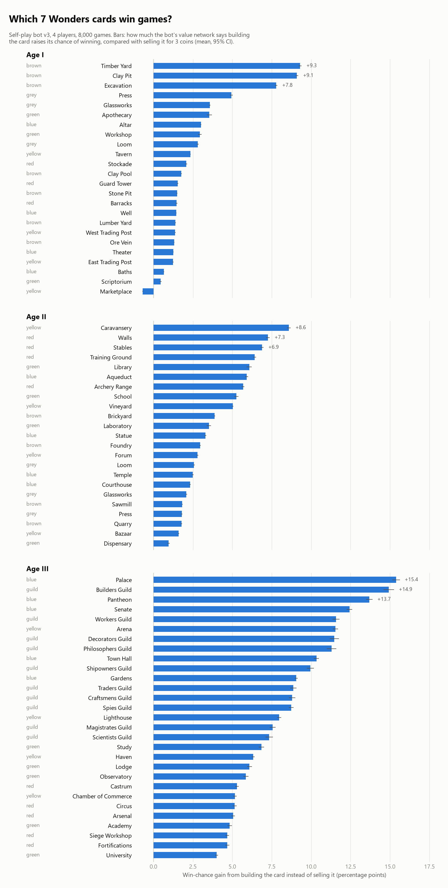
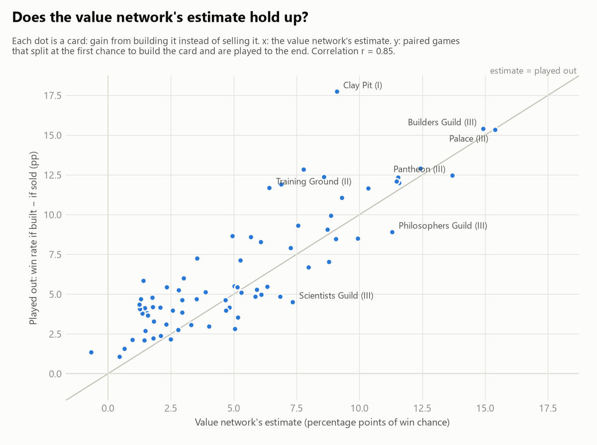

# Card rankings: bot v3

Bot `checkpoints/v3/latest.pt` playing itself in 4-player games of 7 Wonders (2nd edition, base game). 8,000 games were analysed decision by decision, and for every card 4,000 deals were played twice (build it vs. sell it at the first chance) to check the estimates.

## Top cards per Age

- **Age I:** **Timber Yard** (+9.3), **Clay Pit** (+9.1), **Excavation** (+7.8), **Press** (+4.9), **Glassworks** (+3.6)
- **Age II:** **Caravansery** (+8.6), **Walls** (+7.3), **Stables** (+6.9), **Training Ground** (+6.4), **Library** (+6.1)
- **Age III:** **Palace** (+15.4), **Builders Guild** (+14.9), **Pantheon** (+13.7), **Senate** (+12.4), **Workers Guild** (+11.6)

Numbers are percentage points of win chance gained by building the card instead of selling it.

<picture>
  <source media="(prefers-color-scheme: dark)" srcset="figures/card_value_dark.png">
  
</picture>

## How to read this

| Column | Meaning |
|---|---|
| **Gain vs. sell** | Main ranking. At every decision where the card could be built, the bot's value network rates the position after building it and after selling it for 3 coins (other players' moves that turn unchanged). The difference is the change in the bot's estimated chance of winning, in percentage points, averaged over all those decisions, ± 95% CI. |
| **Gain vs. best other** | Same, but compared with the best other option in that hand (building another card, a wonder stage, selling). Negative = usually something else in the hand was better. |
| **Pick rate** | How often the bot builds the card when it is in its hand and affordable. |
| **Win% built / passed** | The bot's final win rate when it built the card vs. when it could have but didn't. Raw correlation, not cause: e.g. players who are already ahead can afford expensive cards. 25% = average. |
| **Played out** | The same question as *gain vs. sell*, answered by playing games instead of asking the network. Each deal is played twice with the bot in every seat; the first time one seat can build the card, it builds it in one copy and sells it in the other, then both games are played to the end. Win-rate difference ± 95% CI, over the deals where that chance came up (n). |
| **Offered** | Number of times the card was in a hand of the analysed games. |

## Age I

| # | Card | Type | Gain vs. sell | Gain vs. best other | Pick rate | Win% built / passed | Played out | Offered |
|---:|---|---|---:|---:|---:|---:|---:|---:|
| 1 | Timber Yard | brown | +9.3 ± 0.1 | +3.3 | 73% | 28% / 29% | +11.1 ± 2.8 (n=1,363) | 10,896 |
| 2 | Clay Pit | brown | +9.1 ± 0.1 | +2.9 | 79% | 26% / 31% | +17.7 ± 3.0 (n=1,229) | 10,163 |
| 3 | Excavation | brown | +7.8 ± 0.1 | +1.2 | 61% | 25% / 29% | +12.8 ± 2.4 (n=1,636) | 13,018 |
| 4 | Press | grey | +4.9 ± 0.1 | −1.2 | 41% | 29% / 24% | +8.7 ± 2.1 (n=2,038) | 17,810 |
| 5 | Glassworks | grey | +3.6 ± 0.1 | −2.2 | 29% | 29% / 24% | +7.2 ± 1.7 (n=2,704) | 24,425 |
| 6 | Apothecary | green | +3.5 ± 0.2 | −2.2 | 41% | 35% / 23% | +7.2 ± 2.2 (n=1,760) | 27,416 |
| 7 | Altar | blue | +3.0 ± <0.1 | −2.8 | 26% | 23% / 25% | +6.0 ± 1.5 (n=3,284) | 29,791 |
| 8 | Workshop | green | +2.9 ± 0.1 | −2.7 | 33% | 34% / 22% | +3.9 ± 2.0 (n=2,023) | 30,041 |
| 9 | Loom | grey | +2.8 ± 0.1 | −2.9 | 26% | 24% / 25% | +5.3 ± 1.7 (n=2,999) | 27,207 |
| 10 | Tavern | yellow | +2.3 ± <0.1 | −3.3 | 24% | 22% / 25% | +5.4 ± 1.4 (n=3,185) | 30,277 |
| 11 | Stockade | red | +2.1 ± 0.1 | −3.8 | 39% | 24% / 26% | +4.2 ± 1.9 (n=2,440) | 26,848 |
| 12 | Clay Pool | brown | +1.8 ± <0.1 | −3.9 | 17% | 23% / 25% | +4.8 ± 1.5 (n=3,399) | 34,617 |
| 13 | Guard Tower | red | +1.5 ± <0.1 | −3.7 | 31% | 23% / 26% | +3.8 ± 1.5 (n=3,670) | 60,768 |
| 14 | Stone Pit | brown | +1.5 ± <0.1 | −4.3 | 15% | 24% / 25% | +2.7 ± 1.4 (n=3,647) | 37,569 |
| 15 | Barracks | red | +1.5 ± <0.1 | −4.0 | 33% | 25% / 25% | +4.1 ± 1.9 (n=2,472) | 29,883 |
| 16 | Well | blue | +1.4 ± <0.1 | −4.1 | 9% | 23% / 25% | +2.1 ± 1.3 (n=3,966) | 44,958 |
| 17 | Lumber Yard | brown | +1.4 ± <0.1 | −4.3 | 34% | 22% / 27% | +5.8 ± 1.5 (n=3,728) | 46,577 |
| 18 | West Trading Post | yellow | +1.4 ± <0.1 | −4.3 | 17% | 23% / 25% | +3.8 ± 1.4 (n=3,650) | 36,657 |
| 19 | Ore Vein | brown | +1.3 ± <0.1 | −4.1 | 20% | 22% / 26% | +4.7 ± 1.4 (n=3,970) | 64,829 |
| 20 | Theater | blue | +1.3 ± <0.1 | −4.0 | 12% | 23% / 25% | +4.1 ± 1.3 (n=3,888) | 42,951 |
| 21 | East Trading Post | yellow | +1.2 ± <0.1 | −3.9 | 17% | 23% / 26% | +4.3 ± 1.4 (n=3,495) | 35,141 |
| 22 | Baths | blue | +0.7 ± <0.1 | −4.5 | 11% | 24% / 25% | +1.6 ± 1.4 (n=3,559) | 44,332 |
| 23 | Scriptorium | green | +0.4 ± 0.1 | −4.8 | 21% | 32% / 24% | +1.1 ± 1.6 (n=3,182) | 68,940 |
| 24 | Marketplace | yellow | −0.7 ± <0.1 | −5.7 | 5% | 21% / 25% | +1.4 ± 1.4 (n=3,939) | 45,590 |

## Age II

| # | Card | Type | Gain vs. sell | Gain vs. best other | Pick rate | Win% built / passed | Played out | Offered |
|---:|---|---|---:|---:|---:|---:|---:|---:|
| 1 | Caravansery | yellow | +8.6 ± 0.1 | +0.9 | 54% | 24% / 28% | +12.4 ± 2.1 (n=1,613) | 16,221 |
| 2 | Walls | red | +7.3 ± 0.1 | −1.0 | 43% | 23% / 26% | +7.9 ± 2.2 (n=1,600) | 27,338 |
| 3 | Stables | red | +6.9 ± 0.1 | −1.5 | 63% | 23% / 28% | +11.9 ± 2.2 (n=1,531) | 13,177 |
| 4 | Training Ground | red | +6.4 ± 0.1 | −1.6 | 47% | 23% / 26% | +11.7 ± 2.0 (n=1,848) | 20,411 |
| 5 | Library | green | +6.1 ± 0.2 | −2.3 | 43% | 36% / 25% | +8.3 ± 2.1 (n=1,599) | 18,799 |
| 6 | Aqueduct | blue | +5.9 ± 0.1 | −2.9 | 33% | 27% / 24% | +5.3 ± 1.7 (n=1,911) | 30,648 |
| 7 | Archery Range | red | +5.7 ± 0.1 | −2.9 | 43% | 23% / 27% | +8.6 ± 1.9 (n=2,032) | 19,531 |
| 8 | School | green | +5.3 ± 0.1 | −2.9 | 37% | 35% / 24% | +7.1 ± 1.9 (n=1,897) | 19,397 |
| 9 | Vineyard | yellow | +5.0 ± 0.1 | −3.7 | 30% | 22% / 25% | +5.5 ± 1.4 (n=2,825) | 24,460 |
| 10 | Brickyard | brown | +3.9 ± <0.1 | −4.4 | 19% | 24% / 26% | +5.1 ± 1.3 (n=3,799) | 57,887 |
| 11 | Laboratory | green | +3.5 ± 0.1 | −4.5 | 30% | 36% / 25% | +4.7 ± 1.9 (n=1,826) | 21,895 |
| 12 | Statue | blue | +3.3 ± 0.1 | −5.2 | 16% | 24% / 25% | +3.1 ± 1.3 (n=3,121) | 36,960 |
| 13 | Foundry | brown | +3.0 ± <0.1 | −5.5 | 13% | 24% / 25% | +4.6 ± 1.3 (n=3,836) | 65,311 |
| 14 | Forum | yellow | +2.8 ± 0.1 | −5.1 | 16% | 21% / 25% | +2.8 ± 1.3 (n=3,138) | 33,202 |
| 15 | Loom | grey | +2.6 ± <0.1 | −5.5 | 13% | 22% / 26% | +4.0 ± 1.4 (n=2,914) | 38,466 |
| 16 | Temple | blue | +2.5 ± 0.1 | −5.5 | 12% | 22% / 26% | +2.2 ± 1.3 (n=3,226) | 41,780 |
| 17 | Courthouse | blue | +2.3 ± <0.1 | −5.6 | 16% | 28% / 26% | +3.1 ± 1.3 (n=3,131) | 38,708 |
| 18 | Glassworks | grey | +2.1 ± <0.1 | −5.4 | 12% | 22% / 24% | +2.4 ± 1.3 (n=2,859) | 38,696 |
| 19 | Sawmill | brown | +1.8 ± <0.1 | −6.2 | 9% | 24% / 26% | +3.3 ± 1.2 (n=3,873) | 68,816 |
| 20 | Press | grey | +1.8 ± <0.1 | −5.6 | 12% | 20% / 24% | +2.2 ± 1.4 (n=2,809) | 38,477 |
| 21 | Quarry | brown | +1.8 ± <0.1 | −6.4 | 12% | 21% / 26% | +4.2 ± 1.2 (n=3,836) | 67,723 |
| 22 | Bazaar | yellow | +1.6 ± <0.1 | −6.5 | 14% | 27% / 25% | +3.7 ± 1.1 (n=3,642) | 36,959 |
| 23 | Dispensary | green | +1.0 ± 0.1 | −7.4 | 17% | 34% / 25% | +2.1 ± 1.3 (n=3,246) | 59,353 |

## Age III

| # | Card | Type | Gain vs. sell | Gain vs. best other | Pick rate | Win% built / passed | Played out | Offered |
|---:|---|---|---:|---:|---:|---:|---:|---:|
| 1 | Palace | blue | +15.4 ± 0.2 | +1.6 | 68% | 29% / 25% | +15.4 ± 2.1 (n=1,436) | 15,328 |
| 2 | Builders Guild | guild | +14.9 ± 0.3 | +1.2 | 63% | 28% / 25% | +15.4 ± 2.7 (n=889) | 10,689 |
| 3 | Pantheon | blue | +13.7 ± 0.2 | +0.5 | 56% | 27% / 26% | +12.5 ± 1.8 (n=1,661) | 16,471 |
| 4 | Senate | blue | +12.4 ± 0.2 | −1.0 | 51% | 27% / 25% | +12.9 ± 1.7 (n=1,838) | 16,266 |
| 5 | Workers Guild | guild | +11.6 ± 0.2 | −2.5 | 38% | 24% / 26% | +12.0 ± 1.9 (n=1,362) | 13,640 |
| 6 | Arena | yellow | +11.5 ± 0.2 | −2.0 | 42% | 25% / 26% | +12.3 ± 1.5 (n=2,071) | 18,700 |
| 7 | Decorators Guild | guild | +11.5 ± 0.3 | −2.6 | 50% | 26% / 26% | +12.1 ± 2.3 (n=1,112) | 10,446 |
| 8 | Philosophers Guild | guild | +11.3 ± 0.3 | −3.2 | 41% | 27% / 27% | +8.9 ± 2.2 (n=1,212) | 13,121 |
| 9 | Town Hall | blue | +10.3 ± 0.2 | −3.5 | 29% | 25% / 26% | +11.6 ± 1.4 (n=2,408) | 30,374 |
| 10 | Shipowners Guild | guild | +9.9 ± 0.2 | −3.9 | 32% | 26% / 26% | +8.5 ± 1.8 (n=1,332) | 17,006 |
| 11 | Gardens | blue | +9.1 ± 0.1 | −4.5 | 23% | 24% / 26% | +8.5 ± 1.0 (n=3,863) | 59,990 |
| 12 | Traders Guild | guild | +8.9 ± 0.2 | −5.1 | 24% | 26% / 27% | +9.9 ± 1.6 (n=1,666) | 18,568 |
| 13 | Craftsmens Guild | guild | +8.8 ± 0.2 | −4.6 | 26% | 28% / 24% | +7.0 ± 1.6 (n=1,556) | 17,815 |
| 14 | Spies Guild | guild | +8.7 ± 0.2 | −4.5 | 23% | 21% / 26% | +9.1 ± 1.5 (n=1,786) | 19,698 |
| 15 | Lighthouse | yellow | +8.0 ± 0.1 | −5.6 | 24% | 22% / 26% | +6.7 ± 1.0 (n=3,082) | 30,234 |
| 16 | Magistrates Guild | guild | +7.6 ± 0.2 | −5.8 | 23% | 22% / 26% | +9.3 ± 1.6 (n=1,537) | 20,275 |
| 17 | Scientists Guild | guild | +7.3 ± 0.2 | −6.1 | 24% | 34% / 23% | +4.5 ± 1.6 (n=1,551) | 17,233 |
| 18 | Study | green | +6.8 ± 0.2 | −6.9 | 25% | 35% / 24% | +4.9 ± 1.3 (n=2,666) | 26,681 |
| 19 | Haven | yellow | +6.3 ± 0.1 | −7.3 | 19% | 23% / 26% | +5.5 ± 1.0 (n=3,795) | 63,648 |
| 20 | Lodge | green | +6.1 ± 0.2 | −7.7 | 22% | 36% / 24% | +5.0 ± 1.2 (n=2,736) | 28,662 |
| 21 | Observatory | green | +5.9 ± 0.2 | −8.0 | 18% | 36% / 25% | +4.9 ± 1.1 (n=2,970) | 31,645 |
| 22 | Castrum | red | +5.3 ± 0.1 | −8.3 | 11% | 20% / 26% | +5.1 ± 1.1 (n=3,555) | 41,804 |
| 23 | Chamber of Commerce | yellow | +5.2 ± 0.1 | −8.3 | 16% | 24% / 26% | +3.5 ± 1.0 (n=3,272) | 35,690 |
| 24 | Circus | red | +5.1 ± 0.1 | −8.2 | 14% | 22% / 25% | +5.4 ± 1.2 (n=3,369) | 39,772 |
| 25 | Arsenal | red | +5.0 ± 0.1 | −8.6 | 10% | 20% / 25% | +2.8 ± 1.1 (n=3,596) | 42,705 |
| 26 | Academy | green | +4.8 ± 0.1 | −8.7 | 17% | 35% / 25% | +4.2 ± 1.2 (n=2,804) | 33,365 |
| 27 | Siege Workshop | red | +4.7 ± 0.1 | −8.8 | 10% | 22% / 26% | +4.0 ± 1.1 (n=3,568) | 42,121 |
| 28 | Fortifications | red | +4.7 ± 0.1 | −8.6 | 11% | 22% / 25% | +4.6 ± 1.1 (n=3,231) | 43,113 |
| 29 | University | green | +4.0 ± 0.1 | −9.6 | 13% | 31% / 25% | +3.0 ± 1.0 (n=3,750) | 70,694 |

## Does the value network's estimate hold up?

<picture>
  <source media="(prefers-color-scheme: dark)" srcset="figures/measures_agreement_dark.png">
  
</picture>

Across cards the estimate and the played-out result correlate with r = 0.85. Dots on the diagonal mean the network judged that card right; dots below it mean the network overrates the card. The two measures also average over slightly different situations: the estimate covers every decision where the card could be built, the played-out games only the *first* such chance in a game.

## Wonder sides

Win rate of each wonder side in the same self-play games (25% = average).

| Wonder side | Win rate | Mean score | Seat-games |
|---|---:|---:|---:|
| Halikarnassos (night) | 40.8% | 57.6 | 2,266 |
| Babylon (night) | 30.8% | 55.1 | 2,302 |
| Ephesos (night) | 30.6% | 56.0 | 2,331 |
| Rhodos (night) | 30.4% | 55.8 | 2,322 |
| Halikarnassos (day) | 26.7% | 53.9 | 2,275 |
| Babylon (day) | 26.7% | 53.7 | 2,272 |
| Ephesos (day) | 25.2% | 53.9 | 2,267 |
| Gizah (night) | 22.2% | 53.7 | 2,248 |
| Alexandria (day) | 21.1% | 52.6 | 2,422 |
| Alexandria (night) | 20.6% | 52.0 | 2,172 |
| Gizah (day) | 20.2% | 52.6 | 2,326 |
| Rhodos (day) | 19.7% | 52.2 | 2,222 |
| Olympia (day) | 17.9% | 51.5 | 2,221 |
| Olympia (night) | 16.9% | 51.3 | 2,354 |

## Caveats

- These are the preferences of one self-taught bot playing copies of itself. A different style of play at your table (e.g. nobody contesting science) changes what is strong.
- The value network is an estimate (it explains roughly a third of the variance in who wins), so treat small differences between neighbouring cards as ties. Confidence intervals treat decisions as independent, so they are somewhat too narrow.
- Card values depend on context (wonder, neighbours, Age, what you already own); these are averages over the situations where the bot could build the card.

## Files

- `card_rankings.csv`: all numbers above at full precision
- `wonders.csv`: wonder-side table
- `figures/`: charts (light and dark versions)

Reproduce: `python scripts/card_rankings.py --checkpoint checkpoints/v3/latest.pt --name v3`
