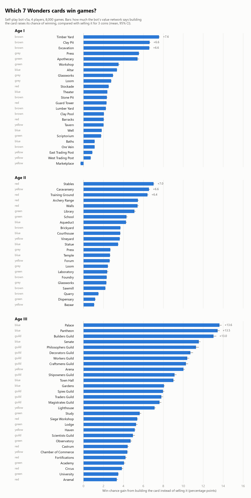
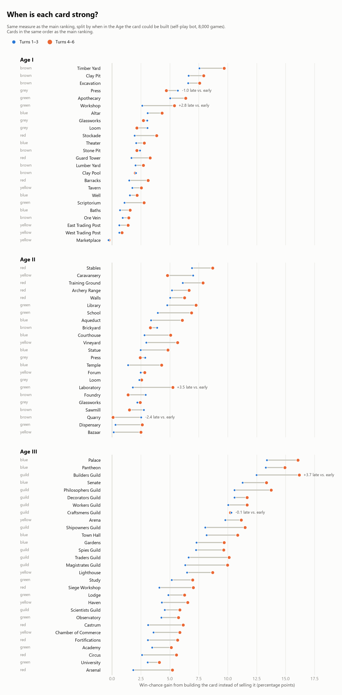
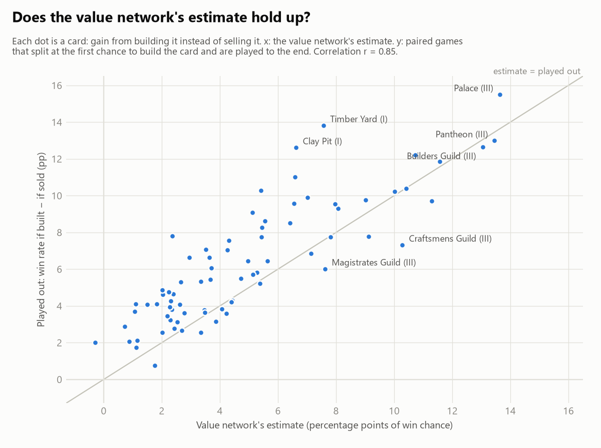

# Card rankings: bot v5a

Bot `checkpoints/v5a/latest.pt` playing itself in 4-player games of 7 Wonders (2nd edition, base game). 8,000 games were analysed decision by decision, and for every card 4,000 deals were played twice (build it vs. sell it at the first chance) to check the estimates.

## Top cards per Age

- **Age I:** **Timber Yard** (+7.6), **Clay Pit** (+6.6), **Excavation** (+6.6), **Press** (+5.5), **Apothecary** (+5.4)
- **Age II:** **Stables** (+7.0), **Caravansery** (+6.6), **Training Ground** (+6.4), **Archery Range** (+5.4), **Walls** (+5.4)
- **Age III:** **Palace** (+13.6), **Pantheon** (+13.5), **Builders Guild** (+13.0), **Senate** (+11.6), **Philosophers Guild** (+11.3)

Numbers are percentage points of win chance gained by building the card instead of selling it.

<picture>
  <source media="(prefers-color-scheme: dark)" srcset="figures/card_value_dark.png">
  
</picture>

## When is each card strong?

The same measure, split by when in the Age the card could be built: the first half (turns 1–3) or the second half (turns 4–6, including Babylon's extra 7th card).

<picture>
  <source media="(prefers-color-scheme: dark)" srcset="figures/card_timing_dark.png">
  
</picture>

- **Age I:** stronger late: Workshop (+2.8), Stockade (+1.9), Scriptorium (+1.7); stronger early: Press (−1.0), Loom (−0.9), Glassworks (−0.3)
- **Age II:** stronger late: Laboratory (+3.5), School (+2.9), Temple (+2.9); stronger early: Quarry (−2.4), Caravansery (−2.2), Foundry (−1.5)
- **Age III:** stronger late: Builders Guild (+3.7), Magistrates Guild (+3.7), Traders Guild (+3.5); stronger early: Craftsmens Guild (−0.1)

Numbers in brackets: late minus early, in percentage points. Only cards that could be built at least 300 times in each half are listed.

Late decisions tend to swing the win chance more in general, because fewer turns remain for anyone to respond (most visible in Age III, where nearly every card gains late). So compare a card's shift with the other cards of the same Age rather than with zero.

The played-out check is split the same way in `card_rankings.csv` (`played_gain_early` / `played_gain_late`).

## How to read this

| Column | Meaning |
|---|---|
| **Gain vs. sell** | Main ranking. At every decision where the card could be built, the bot's value network rates the position after building it and after selling it for 3 coins (other players' moves that turn unchanged). The difference is the change in the bot's estimated chance of winning, in percentage points, averaged over all those decisions, ± 95% CI. |
| **Early / Late** | Gain vs. sell, only counting decisions in turns 1–3 / turns 4–6 of the Age. |
| **Gain vs. best other** | Same, but compared with the best other option in that hand (building another card, a wonder stage, selling). Negative = usually something else in the hand was better. |
| **Pick rate** | How often the bot builds the card when it is in its hand and affordable. |
| **Win% built / passed** | The bot's final win rate when it built the card vs. when it could have but didn't. Raw correlation, not cause: e.g. players who are already ahead can afford expensive cards. 25% = average. |
| **Played out** | The same question as *gain vs. sell*, answered by playing games instead of asking the network. Each deal is played twice with the bot in every seat; the first time one seat can build the card, it builds it in one copy and sells it in the other, then both games are played to the end. Win-rate difference ± 95% CI, over the deals where that chance came up (n). |
| **Offered** | Number of times the card was in a hand of the analysed games. |

## Age I

| # | Card | Type | Gain vs. sell | Early | Late | Gain vs. best other | Pick rate | Win% built / passed | Played out | Offered |
|---:|---|---|---:|---:|---:|---:|---:|---:|---:|---:|
| 1 | Timber Yard | brown | +7.6 ± 0.1 | +7.6 | +9.7 | +2.5 | 74% | 29% / 29% | +13.8 ± 2.8 (n=1,317) | 10,787 |
| 2 | Clay Pit | brown | +6.6 ± 0.1 | +6.6 | +7.9 | +0.8 | 67% | 26% / 29% | +12.6 ± 2.6 (n=1,439) | 11,901 |
| 3 | Excavation | brown | +6.6 ± 0.1 | +6.6 | +7.6 | +1.0 | 63% | 27% / 29% | +11.0 ± 2.5 (n=1,529) | 12,727 |
| 4 | Press | grey | +5.5 ± 0.1 | +5.7 | +4.7 | −0.4 | 42% | 28% / 24% | +8.6 ± 2.1 (n=2,012) | 17,473 |
| 5 | Apothecary | green | +5.4 ± 0.2 | +5.0 | +6.4 | −1.1 | 48% | 34% / 22% | +7.8 ± 2.4 (n=1,695) | 25,512 |
| 6 | Workshop | green | +3.5 ± 0.1 | +2.6 | +5.4 | −2.9 | 36% | 33% / 23% | +7.1 ± 2.1 (n=1,896) | 28,146 |
| 7 | Altar | blue | +3.3 ± <0.1 | +3.1 | +4.3 | −3.0 | 29% | 25% / 25% | +5.3 ± 1.5 (n=3,073) | 26,801 |
| 8 | Glassworks | grey | +3.0 ± 0.1 | +3.0 | +2.7 | −2.9 | 28% | 27% / 24% | +6.6 ± 1.8 (n=2,659) | 24,674 |
| 9 | Loom | grey | +2.8 ± <0.1 | +3.1 | +2.1 | −3.2 | 24% | 21% / 26% | +3.6 ± 1.7 (n=2,881) | 27,663 |
| 10 | Stockade | red | +2.5 ± <0.1 | +1.9 | +3.8 | −3.8 | 34% | 25% / 26% | +3.1 ± 1.8 (n=2,589) | 29,904 |
| 11 | Theater | blue | +2.4 ± <0.1 | +2.1 | +2.8 | −3.6 | 12% | 24% / 25% | +4.6 ± 1.3 (n=3,892) | 42,307 |
| 12 | Stone Pit | brown | +2.3 ± <0.1 | +2.4 | +2.1 | −3.6 | 25% | 23% / 25% | +3.8 ± 1.6 (n=3,098) | 28,482 |
| 13 | Guard Tower | red | +2.3 ± <0.1 | +1.7 | +3.3 | −3.5 | 29% | 22% / 26% | +3.2 ± 1.5 (n=3,699) | 63,576 |
| 14 | Lumber Yard | brown | +2.2 ± <0.1 | +2.0 | +2.7 | −3.8 | 25% | 23% / 26% | +4.7 ± 1.4 (n=3,888) | 56,058 |
| 15 | Clay Pool | brown | +2.0 ± <0.1 | +2.1 | +2.0 | −4.0 | 15% | 23% / 25% | +4.6 ± 1.5 (n=3,553) | 37,674 |
| 16 | Barracks | red | +2.0 ± <0.1 | +1.5 | +3.1 | −4.0 | 34% | 23% / 25% | +2.5 ± 1.9 (n=2,457) | 30,685 |
| 17 | Tavern | yellow | +2.0 ± <0.1 | +1.8 | +2.5 | −4.0 | 22% | 23% / 25% | +4.9 ± 1.5 (n=3,247) | 31,608 |
| 18 | Well | blue | +1.8 ± <0.1 | +1.5 | +2.2 | −4.2 | 11% | 25% / 25% | +4.1 ± 1.3 (n=3,934) | 43,450 |
| 19 | Scriptorium | green | +1.8 ± 0.1 | +1.1 | +2.8 | −4.5 | 23% | 31% / 24% | +0.8 ± 1.6 (n=3,132) | 65,499 |
| 20 | Baths | blue | +1.1 ± <0.1 | +0.7 | +1.6 | −4.4 | 15% | 25% / 25% | +1.7 ± 1.4 (n=3,490) | 41,796 |
| 21 | Ore Vein | brown | +1.1 ± <0.1 | +0.9 | +1.4 | −4.9 | 17% | 21% / 26% | +4.1 ± 1.4 (n=3,953) | 66,169 |
| 22 | East Trading Post | yellow | +0.9 ± <0.1 | +0.6 | +1.4 | −4.8 | 18% | 20% / 26% | +2.1 ± 1.4 (n=3,444) | 34,119 |
| 23 | West Trading Post | yellow | +0.7 ± <0.1 | +0.6 | +0.9 | −5.2 | 12% | 24% / 25% | +2.9 ± 1.4 (n=3,760) | 39,970 |
| 24 | Marketplace | yellow | −0.3 ± <0.1 | −0.3 | −0.3 | −6.1 | 5% | 23% / 25% | +2.0 ± 1.4 (n=3,860) | 44,391 |

## Age II

| # | Card | Type | Gain vs. sell | Early | Late | Gain vs. best other | Pick rate | Win% built / passed | Played out | Offered |
|---:|---|---|---:|---:|---:|---:|---:|---:|---:|---:|
| 1 | Stables | red | +7.0 ± 0.1 | +6.9 | +8.7 | −1.5 | 56% | 23% / 27% | +9.9 ± 2.1 (n=1,663) | 15,019 |
| 2 | Caravansery | yellow | +6.6 ± 0.1 | +7.0 | +4.8 | −1.4 | 47% | 26% / 26% | +9.6 ± 2.0 (n=1,809) | 18,513 |
| 3 | Training Ground | red | +6.4 ± 0.1 | +6.1 | +7.9 | −1.8 | 48% | 22% / 27% | +8.5 ± 1.9 (n=1,818) | 20,923 |
| 4 | Archery Range | red | +5.4 ± 0.1 | +5.2 | +6.7 | −3.2 | 36% | 25% / 27% | +8.3 ± 1.8 (n=2,229) | 22,398 |
| 5 | Walls | red | +5.4 ± 0.1 | +5.0 | +6.3 | −2.6 | 41% | 24% / 26% | +10.3 ± 2.0 (n=1,717) | 26,568 |
| 6 | Library | green | +5.1 ± 0.1 | +4.8 | +7.3 | −1.8 | 43% | 34% / 24% | +9.1 ± 2.0 (n=1,726) | 18,497 |
| 7 | School | green | +4.3 ± 0.1 | +4.0 | +6.9 | −2.6 | 37% | 34% / 24% | +7.5 ± 2.0 (n=1,848) | 19,024 |
| 8 | Aqueduct | blue | +4.3 ± 0.1 | +3.4 | +6.1 | −3.5 | 35% | 26% / 25% | +7.0 ± 1.6 (n=2,023) | 29,849 |
| 9 | Brickyard | brown | +3.7 ± <0.1 | +3.9 | +3.3 | −4.3 | 21% | 25% / 25% | +6.1 ± 1.3 (n=3,777) | 55,512 |
| 10 | Courthouse | blue | +3.7 ± 0.1 | +2.8 | +5.1 | −4.9 | 20% | 26% / 26% | +5.4 ± 1.3 (n=2,995) | 35,003 |
| 11 | Vineyard | yellow | +3.6 ± <0.1 | +3.0 | +5.7 | −3.9 | 26% | 22% / 26% | +6.6 ± 1.2 (n=3,093) | 27,985 |
| 12 | Statue | blue | +3.5 ± <0.1 | +2.5 | +4.8 | −4.8 | 19% | 24% / 25% | +3.8 ± 1.3 (n=3,111) | 37,741 |
| 13 | Press | grey | +2.7 ± <0.1 | +2.9 | +2.4 | −5.5 | 15% | 20% / 25% | +2.7 ± 1.4 (n=2,767) | 36,562 |
| 14 | Temple | blue | +2.7 ± 0.1 | +1.4 | +4.3 | −5.7 | 15% | 24% / 26% | +5.3 ± 1.4 (n=3,088) | 39,111 |
| 15 | Forum | yellow | +2.6 ± 0.1 | +2.5 | +2.8 | −5.6 | 15% | 23% / 25% | +4.1 ± 1.3 (n=3,183) | 34,518 |
| 16 | Loom | grey | +2.4 ± <0.1 | +2.4 | +2.5 | −5.8 | 14% | 20% / 27% | +2.8 ± 1.4 (n=2,862) | 37,072 |
| 17 | Laboratory | green | +2.4 ± 0.1 | +1.8 | +5.2 | −4.3 | 35% | 35% / 24% | +7.8 ± 2.0 (n=1,884) | 21,141 |
| 18 | Foundry | brown | +2.3 ± <0.1 | +2.9 | +1.4 | −5.7 | 15% | 24% / 26% | +4.3 ± 1.2 (n=3,859) | 64,198 |
| 19 | Glassworks | grey | +2.3 ± <0.1 | +2.2 | +2.4 | −5.7 | 15% | 22% / 24% | +3.9 ± 1.4 (n=2,785) | 36,490 |
| 20 | Sawmill | brown | +2.2 ± <0.1 | +2.7 | +1.5 | −6.2 | 8% | 24% / 26% | +3.5 ± 1.2 (n=3,901) | 73,067 |
| 21 | Quarry | brown | +1.5 ± <0.1 | +2.5 | +0.1 | −6.4 | 11% | 22% / 26% | +4.1 ± 1.2 (n=3,875) | 66,896 |
| 22 | Dispensary | green | +1.2 ± 0.1 | +0.3 | +2.6 | −7.0 | 19% | 32% / 25% | +2.1 ± 1.3 (n=3,346) | 61,959 |
| 23 | Bazaar | yellow | +1.1 ± <0.1 | +0.1 | +2.5 | −6.6 | 13% | 27% / 25% | +3.7 ± 1.1 (n=3,752) | 38,418 |

## Age III

| # | Card | Type | Gain vs. sell | Early | Late | Gain vs. best other | Pick rate | Win% built / passed | Played out | Offered |
|---:|---|---|---:|---:|---:|---:|---:|---:|---:|---:|
| 1 | Palace | blue | +13.6 ± 0.2 | +13.4 | +16.1 | +0.8 | 60% | 28% / 26% | +15.5 ± 2.1 (n=1,474) | 15,953 |
| 2 | Pantheon | blue | +13.5 ± 0.2 | +13.3 | +14.9 | +0.2 | 53% | 29% / 25% | +13.0 ± 1.8 (n=1,678) | 16,407 |
| 3 | Builders Guild | guild | +13.0 ± 0.3 | +12.5 | +16.2 | −0.3 | 56% | 27% / 26% | +12.7 ± 2.5 (n=885) | 11,107 |
| 4 | Senate | blue | +11.6 ± 0.2 | +11.3 | +13.4 | −1.7 | 43% | 28% / 24% | +11.9 ± 1.6 (n=2,067) | 18,990 |
| 5 | Philosophers Guild | guild | +11.3 ± 0.3 | +10.6 | +13.8 | −2.4 | 38% | 31% / 26% | +9.7 ± 2.2 (n=1,240) | 13,650 |
| 6 | Decorators Guild | guild | +10.7 ± 0.3 | +10.6 | +11.7 | −2.9 | 49% | 26% / 26% | +12.2 ± 2.3 (n=1,082) | 10,499 |
| 7 | Workers Guild | guild | +10.4 ± 0.2 | +10.0 | +11.7 | −2.5 | 33% | 25% / 25% | +10.4 ± 1.9 (n=1,404) | 14,417 |
| 8 | Craftsmens Guild | guild | +10.3 ± 0.2 | +10.3 | +10.2 | −3.1 | 25% | 30% / 24% | +7.3 ± 1.7 (n=1,483) | 17,012 |
| 9 | Arena | yellow | +10.0 ± 0.1 | +9.8 | +11.2 | −2.7 | 37% | 26% / 25% | +10.2 ± 1.4 (n=2,344) | 20,752 |
| 10 | Shipowners Guild | guild | +9.1 ± 0.2 | +8.1 | +11.5 | −3.7 | 29% | 27% / 26% | +7.8 ± 1.8 (n=1,339) | 17,980 |
| 11 | Town Hall | blue | +9.0 ± 0.1 | +8.2 | +10.8 | −3.7 | 26% | 26% / 25% | +9.8 ± 1.3 (n=2,560) | 30,925 |
| 12 | Gardens | blue | +8.1 ± 0.1 | +7.3 | +9.7 | −4.7 | 22% | 25% / 25% | +9.3 ± 1.1 (n=3,858) | 60,120 |
| 13 | Spies Guild | guild | +8.0 ± 0.1 | +7.3 | +9.6 | −5.3 | 23% | 22% / 26% | +9.5 ± 1.5 (n=1,736) | 18,215 |
| 14 | Traders Guild | guild | +7.8 ± 0.2 | +6.6 | +10.1 | −5.3 | 22% | 27% / 26% | +7.8 ± 1.5 (n=1,716) | 19,304 |
| 15 | Magistrates Guild | guild | +7.6 ± 0.2 | +6.3 | +10.0 | −5.0 | 24% | 23% / 26% | +6.0 ± 1.7 (n=1,396) | 19,782 |
| 16 | Lighthouse | yellow | +7.1 ± 0.1 | +6.5 | +8.7 | −5.3 | 22% | 25% / 25% | +6.9 ± 1.1 (n=3,039) | 29,930 |
| 17 | Study | green | +5.6 ± 0.1 | +5.2 | +7.0 | −7.5 | 23% | 34% / 24% | +6.4 ± 1.3 (n=2,596) | 26,274 |
| 18 | Siege Workshop | red | +5.4 ± 0.1 | +4.1 | +7.0 | −7.9 | 10% | 23% / 25% | +5.2 ± 1.0 (n=3,605) | 41,651 |
| 19 | Lodge | green | +5.3 ± 0.1 | +4.9 | +6.3 | −7.7 | 22% | 34% / 24% | +5.8 ± 1.3 (n=2,798) | 27,934 |
| 20 | Haven | yellow | +5.1 ± 0.1 | +4.3 | +6.5 | −7.6 | 16% | 25% / 26% | +5.7 ± 1.0 (n=3,810) | 67,479 |
| 21 | Scientists Guild | guild | +5.0 ± 0.2 | +4.6 | +5.8 | −6.5 | 23% | 31% / 24% | +6.5 ± 1.7 (n=1,580) | 17,430 |
| 22 | Observatory | green | +4.7 ± 0.1 | +4.3 | +5.7 | −8.1 | 21% | 34% / 24% | +5.5 ± 1.3 (n=2,729) | 29,378 |
| 23 | Castrum | red | +4.4 ± 0.1 | +3.1 | +6.1 | −8.3 | 11% | 19% / 26% | +4.3 ± 1.1 (n=3,647) | 41,142 |
| 24 | Chamber of Commerce | yellow | +4.4 ± 0.1 | +3.6 | +5.9 | −8.5 | 17% | 23% / 25% | +4.2 ± 1.0 (n=3,247) | 34,461 |
| 25 | Fortifications | red | +4.2 ± 0.1 | +3.1 | +5.7 | −8.7 | 12% | 23% / 24% | +3.6 ± 1.1 (n=3,184) | 41,284 |
| 26 | Academy | green | +4.1 ± 0.1 | +3.5 | +5.1 | −9.0 | 15% | 34% / 24% | +3.8 ± 1.1 (n=2,944) | 34,374 |
| 27 | Circus | red | +3.9 ± 0.1 | +2.6 | +5.6 | −9.0 | 13% | 20% / 25% | +3.1 ± 1.1 (n=3,419) | 40,052 |
| 28 | University | green | +3.5 ± 0.1 | +3.1 | +4.1 | −9.5 | 13% | 30% / 25% | +3.6 ± 1.0 (n=3,735) | 69,114 |
| 29 | Arsenal | red | +3.3 ± 0.1 | +1.8 | +5.2 | −9.7 | 10% | 18% / 26% | +2.5 ± 1.1 (n=3,537) | 42,092 |

## Does the value network's estimate hold up?

<picture>
  <source media="(prefers-color-scheme: dark)" srcset="figures/measures_agreement_dark.png">
  
</picture>

Across cards the estimate and the played-out result correlate with r = 0.85. Dots on the diagonal mean the network judged that card right; dots below it mean the network overrates the card. The two measures also average over slightly different situations: the estimate covers every decision where the card could be built, the played-out games only the *first* such chance in a game.

## Wonder sides

The bot picks its own wonder side (Day or Night) at the start, as in the real game. How often it picks Night:

| Wonder | Night picked |
|---|---:|
| Babylon | 100% |
| Ephesos | 100% |
| Gizah | 100% |
| Halikarnassos | 100% |
| Rhodos | 100% |
| Olympia | 96% |
| Alexandria | 43% |

Win rate of each side in the same self-play games (25% = average). Sides the bot rarely picks have few games, so their numbers are less reliable.

| Wonder side | Win rate | Mean score | Seat-games |
|---|---:|---:|---:|
| Halikarnassos (night) | 38.8% | 57.8 | 4,541 |
| Rhodos (night) | 27.5% | 56.0 | 4,544 |
| Babylon (night) | 25.7% | 54.9 | 4,574 |
| Ephesos (night) | 25.4% | 55.2 | 4,598 |
| Gizah (night) | 23.6% | 54.0 | 4,574 |
| Alexandria (night) | 19.0% | 51.8 | 1,967 |
| Alexandria (day) | 18.1% | 52.0 | 2,627 |
| Olympia (night) | 15.7% | 51.5 | 4,384 |
| Olympia (day) | 14.9% | 47.3 | 191 |

## Caveats

- These are the preferences of one self-taught bot playing copies of itself. A different style of play at your table (e.g. nobody contesting science) changes what is strong.
- The value network is an estimate (it explains roughly a third of the variance in who wins), so treat small differences between neighbouring cards as ties. Confidence intervals treat decisions as independent, so they are somewhat too narrow.
- Card values depend on context (wonder, neighbours, Age, what you already own); these are averages over the situations where the bot could build the card.

## Files

- `card_rankings.csv`: all numbers above at full precision
- `wonders.csv`: wonder-side table
- `figures/`: charts (light and dark versions)

Reproduce: `python scripts/card_rankings.py --checkpoint checkpoints/v5a/latest.pt --name v5a`
